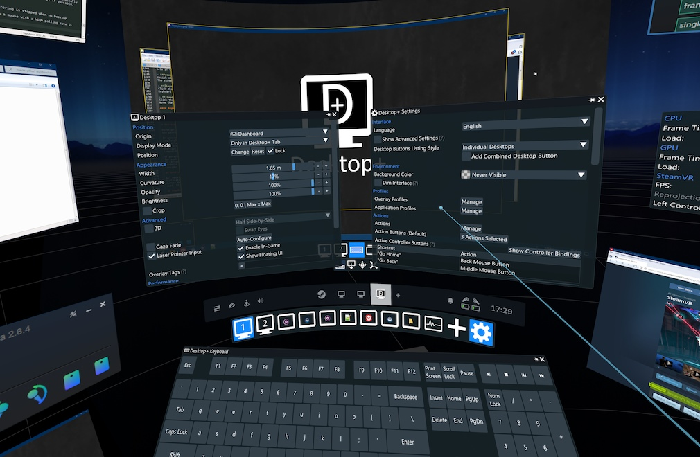

# Desktop+ VR Overlay
Advanced desktop access for OpenVR.

## Features

- User interface with real-time adjustments accessible in VR or on desktop
- Smooth, low-latency mirroring of desktops and windows
- Low memory footprint and performance impact
- Support for creating as many overlays as SteamVR allows at once
- Customizable overlay settings (width, position, curvature, opacity), with switchable profiles
- Overlay cropping
- 3D support (SBS, HSBS, OU, HOU)
- Overlay visibility and origin settings: Display a desktop/window during gameplay or attach it to a different origin (play space, dashboard, HMD, controllers, tracker)
- Actions: User-definable functions (input simulation, running applications) which can be bound to controller or UI buttons
- Keyboard Extension, enabling use of modifier, arrow and function keys from the SteamVR keyboard
- Elevated access toggle, making it possible to deal with UAC prompts and other UIP-restricted UI in VR without using full admin-access at all times
- Gaze Fade: Fade-out overlay when not looking at it
- Window Management: Change window focus depending on overlay/dashboard state or drag overlays when dragging the title bar of a mirrored window

## Usage

### Release Archive

Download and extract the latest archive from the [releases page](https://github.com/elvissteinjr/DesktopPlus/releases). Follow instructions in the included [readme file](assets/readme.txt).

### Building from Source

The Visual Studio 2019 Solution builds out of the box with no further external dependencies.  
Building with Graphics Capture support requires Windows SDK 10.0.19041 or newer, and will download C++/WinRT packages automatically.
Graphics Capture support can be disabled entirely if desired. Windows 8 SDK or newer is sufficient in that case. See DesktopPlusWinRT.h for details.

Other compilers likely work as well, but are neither tested nor have a build configuration.

After building, add the contents of the [assets](assets) directory to the executables.

## Demonstration

[comment]: # (Honestly kind of lost here. Would've preferred to host the clips on the repo, but people probably want them to play in the browser and not download instead)

A few short videos showcasing some of Desktop+' features:
- [Version 2.2 Showcase: Multiple Overlays, Floating UI, Scene App Auto-focus, Update Limiter Override](http://www.elvissteinjr.net/dplus/demo_v2_2_showcase.mp4)
- [Version 2.1 Showcase: Gaze Fade, Auto Interaction Toggle, Crop to Active Window, FPS-based Limiter](http://www.elvissteinjr.net/dplus/demo_v2_1_showcase.mp4)
- [Custom Actions](http://www.elvissteinjr.net/dplus/demo_custom_action.mp4)
- [Floating Overlay](http://www.elvissteinjr.net/dplus/demo_detached.mp4)
- [Cropping & Floating Overlay Origins](http://www.elvissteinjr.net/dplus/demo_detached_cropping.mp4)
- [Elevated Mode](http://www.elvissteinjr.net/dplus/demo_elevated_mode.mp4)

Most of these are from older builds with a slightly different interface, but the features themselves still work the same in the current version.

## Documentation

For basic usage, installation and troubleshooting see the included [readme file](assets/readme.txt).  
For more detailed information on each setting, step-by-step examples for a few common usage scenarios and more check out the [User Guide](docs/user_guide.md).

## Notes

Desktop+ only runs on Windows 8 or newer, as it uses the DXGI Desktop Duplication API which is not available on older versions of Windows.  
Window mirroring through Graphics Capture requires at least Windows 10 1803 for basic support, Windows 10 2004 or newer for full support.

Releases are only provided as 64-bit executables, but it can be built for 32-bit. Note that this configuration has not gone through testing, however.

## License

This software is licensed under the GPL 3.0.  
Desktop+ includes work of third-party projects. For their licenses, see [here](assets/third-party_licenses.txt).
