# Desktop+ User Guide

This document explains the options in Desktop+ and possible usage scenarios in greater detail. It is generally not required to be read in order to get started with Desktop+, but can serve as a reference if one does get stuck.  
This guide does not touch upon all topics covered by the [readme file](../assets/readme.txt). It's recommended to read it beforehand.

# Contents

* [Glossary](#glossary)
* [Interface](#interface)
  * [Overlay Bar](#overlay-bar)

  * [Floating UI](#floating-ui)
    * [Main Bar](#main-bar)
    * [Action Bar](#action-bar)

  * [Settings Window](#settings-window)
    * [Main Page](#main-page)
      * [Interface](#interface)
      * [Environment](#environment)
      * [Profiles](#profiles)
      * [Actions](#actions)
      * [Keyboard](#keyboard)
      * [Mouse](#mouse)
      * [Laser Pointer](#laser-pointer)
      * [Window Overlays](#window-overlays)
      * [Browser](#browser)
      * [Performance](#performance)
      * [Version Info](#version-info)
      * [Warnings](#warnings)
      * [Startup](#startup)
      * [Troubleshooting](#troubleshooting)
    * [Persistent UI Page](#persistent-ui-page)
      * [Windows](#windows)
    * [Manage Overlay Profiles Page](#manage-overlay-profiles-page)
    * [Manage Application Profiles Page](#manage-application-profiles-page)
    * [Manage Actions Page](#manage-actions-page)
    * [Edit Action Page](#manage-actions-page)
      * [Button Appearance](#button-appearance)
      * [Commands](#commands)
    * [Change Action Order Page](#change-action-order-page)
    * [Keyboard Layout Page](#keyboard-layout-page)
      * [Key Clusters](#key-clusters)
    * [Restore Default Settings Page](#restore-default-settings-page)

  * [Overlay Properties](#overlay-properties)
    * [Main Page](#main-page-1)
      * [Position](#position)
      * [Appearance](#appearance)
      * [Capture](#capture)
      * [Performance Monitor](#performance-monitor)
      * [Browser](#browser-1)
      * [Advanced](#advanced)
      * [Performance](#performance-1)
      * [Interface](#interface-2)
    * [Change Overlay Position Page](#change-overlay-position-page)
      * [Manual Adjustment](#manual-adjustment)
      * [Additional Offset](#additional-offset)
      * [Drag Settings](#drag-settings)
    * [Cropping Area Page](#cropping-area-page)
      * [Manual Adjustment](#manual-adjustment-1)

  * [Desktop Mode](#desktop-mode)
    * [Tools](#tools)
    * [Overlays](#overlays)
    * [Keyboard Controls](#keyboard-controls)

  * [Desktop+ Keyboard](#desktop-keyboard)
    * [Keyboard Layout Editor](#keyboard-layout-editor)
      * [Key List](#key-list)
      * [Key Properties](#key-properties)
      * [Layout Metadata](#layout-metadata)
      * [Keyboard Preview](#keyboard-preview)

* [Performance Considerations](#performance-considerations)
  * [Desktop Duplication](#desktop-duplication-1)
  * [Graphics Capture](#graphics-capture-1)
  * [Desktop Duplication vs. Graphics Capture](#desktop-duplication-vs-graphics-capture)
    * [Desktop Duplication](#desktop-duplication-2)
      * [Mirroring at Unconstrained Frame-Rates](#mirroring-at-unconstrained-frame-rates)
    * [Graphics Capture](#graphics-capture-2)
      * [Graphics Capture Feature Support](#graphics-capture-feature-support)

* [VR Interactions](#vr-interactions)

* [Usage Examples](#usage-examples)
  * [Attach Overlay to a Motion-Controller, Wristwatch-Style](#attach-overlay-to-a-motion-controller-wristwatch-style)
  * [Show Multiple Desktops or Windows in the Dashboard at Once](#show-multiple-desktops-or-windows-in-the-dashboard-at-once)
  * [Simulate Keyboard Shortcut from Motion-Controller Input](#simulate-keyboard-shortcut-from-motion-controller-input)

* [Advanced Features](#advanced-features)
  * [Hidden Configuration Settings](#hidden-configuration-settings)
  * [System-wide Modifications](#system-wide-modifications)
  * [Command-Line Arguments](#command-line-arguments)
    * [Desktop+ Browser](#desktop-browser)

# Glossary

These are some of the terms used across the application and its documentation.

### Overlay

An overlay in the context of SteamVR refers to a 2D surface displayed either in the SteamVR dashboard or somewhere in the VR space.  
In Desktop+, "overlay" usually only refers to overlays that belong to the application, unless it's explicitly spelled out as "SteamVR overlay".

### Dashboard

Dashboard in the context of SteamVR refers to the menu that appears when using the system menu button in SteamVR.

### Floating UI

An interface fading in when hovering an overlay, consisting of a Main Bar with quick access to disabling the overlay, toggling drag-mode, overlay-specific buttons and showing an additional Action Bar with customizable buttons.

### Action

Action in the context of Desktop+ refers to a series of commands that can control the ,state of your overlays simulate input and execute programs.
Actions can be user-created and bound to controller buttons, the Floating UI, or just executed from the action list.

### Desktop Duplication

One of the capture methods available for capturing desktops for overlay display. Its name comes from the DXGI Desktop Duplication API it is using.

### Graphics Capture

One of the capture methods available for capturing desktops and windows for overlay display. Its name comes from the Graphics Capture API it's using.

### Gaze Fade

A method to automatically adjust an overlay's opacity based on the user's gaze. The method in Desktop+ is distance-based, as opposed to other angle-based approaches.

### Browser Overlay

Overlays using the Desktop+ Browser component, a Chromium Embedded Framework-based internal web browser.  
This application component is optional and has to be installed separately, either from https://github.com/elvissteinjr/DesktopPlusBrowser or Steam (as DLC for Desktop+).
Options related to browser overlays are hidden if the application component is not installed.

### Primary Dashboard Overlay

The first visible overlay with the dashboard origin. It is used a reference or fallback in some scenarios, but isn't strictly required to exist.

# Interface

## Overlay Bar

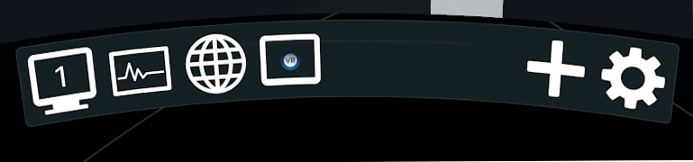

The Overlay Bar appears in the Desktop+ dashboard tab and allows managing all active overlays, as well as accessing the settings window.

- **(Overlay Buttons)**:  
Click on the button to pop up a menu with options to show/hide, duplicate, remove the overlay, or to change the overlay's properties.  
The Overlay Properties window can only be shown for one overlay at once. Trying to show it for another will make the existing window switch to that overlay.  
The overlay buttons can also be double-clicked to toggle visibility, right-clicked to quickly access the overlay properties, and long-pressed for a few seconds to reset the Overlay Properties window position.

Pointing at the SteamVR dashboard will result in the Overlay Bar to fade out temporarily. This is to allow using the dashboard's drag handle, as well as to make space for elements of the dashboard that may slide out on interaction.

- **[+]**:  
Adds a new overlay. A menu will pop up, listing the available overlay types/capture sources.  
After choosing one, keep holding the trigger to drag the newly created overlay to the desired spot and then let it go. If the trigger was released immediately, it requires an additional click to let the overlay go.

- **[⛭]**:  
Shows or hides the settings window.

## Floating UI

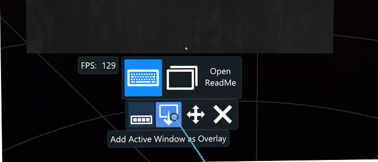

The Floating UI appears when pointing at an overlay and consists of a Main bar allow quick access to overlay functions, as well as an additional Action Bar with customizable buttons.  
The primary dashboard overlay always displays its Floating UI as long as no other overlay is being hovered.

### Main Bar

- **Toggle Action Bar ([...])**:  
Toggles visibility of the Action Bar. It appears right above the Main Bar.

- **Enable/Disable Drag-Mode ([Arrows])**:  
Toggles the overlay drag-mode. While drag-mode is enabled, all laser pointer input on drag overlays around instead.  
During drags, use vertical scroll input to change the distance to the overlay and horizontal scroll input to resize it.
Right-click on overlays to perform a two-handed gesture drag instead, which allows to rotate and scale the overlay in place.  

  This button can be long-pressed for a few seconds to lock the overlay's position instead.

- **Hide Overlay ([X])**:  
Hides the overlay. This is the same as pressing "Hide" in the Overlay Bar.  
This button can be long-pressed for a few seconds to remove the overlay instead.

- **Add Active Window as Overlay ([Window with Arrow])** (only visible for desktop overlays):  
Press and hold this button to add a new overlay of the currently focused window. This is similar to adding a new overlay in the Overlay Bar.  
The new overlay will start as being dragged, allowing you to position it.

  This button can be hidden via the ["[x] Show Extra Buttons"](#interface-2) overlay property.

- **Reset Cumulative Values ([Performance Monitor Refresh Icon])** (only visible for Performance Monitor overlays):  
Resets most values of the Performance Monitor. This includes everything that represent an average or is counted up over time.

  This button can be hidden via the ["[x] Show Extra Buttons"](#interface-2) overlay property.

- **Go to Previous Page ([🡸])** (only visible for browser overlays):  
Goes back in the browser's navigation history.

  This button can be hidden via the ["[x] Show Extra Buttons"](#interface-2) overlay property.
  
- **Go to Next Page ([🡺])** (only visible for browser overlays):  
Goes forward in the browser's navigation history.

  This button can be hidden via the ["[x] Show Extra Buttons"](#interface-2) overlay property.
  
- **Refresh Current Page/Stop Page Load ([⟳/🚫])** (only visible for browser overlays):  
Refreshes/reloads the current page or stops if it's currently loading.

  This button can be hidden via the ["[x] Show Extra Buttons"](#interface-2) overlay property.
  
### Action Bar

The Action Bar contains a set of customizable action buttons which can be set either globally or for individual overlays.  
Pressing on action buttons will execute the associated action. Actions pressing keys will hold them as long as the button is held and release them once the button is released.

The *Show Keyboard* action button can be long-pressed for a few seconds to reset the [VR Keyboard's](#desktop-keyboard) position.

## Settings Window

### Main Page

#### Interface

- **Language**:  
Change the application language. On first launch, Desktop+ tries to set this to the operating system's language if a matching translation is available.  
Some of the languages listed are community translations, which may lag behind after updates and be incomplete.

- **[x] Show Advanced Settings**:  
Sets if settings marked as advanced are being shown. Advanced settings are rarely-used settings and more in-depth options for other, always displayed settings.  
When unticked, relevant settings are only hidden in the interface, not turned off.  
Advanced settings are marked with *(Adv.)* in this document.

- **[x] Drag Windows When Clicking on Blank Space** (Adv.):  
Sets if Desktop+ interface windows can be dragged by pressing and holding anywhere on the window as long as there's no widget in the way.  
When unticked, interface windows can only be dragged from the title bar.

- **Persistent UI** (Adv.):  
Press the button to manage the [Persistent UI settings](#persistent-ui-page).

- **Desktop Buttons Listing Style**:  
Changes the way the desktops are listed on the Action Bar or if at all.
  - **[x] Add Combined Desktop**:  
  Adds a button for the combined desktop to the Action Bar.

#### Environment

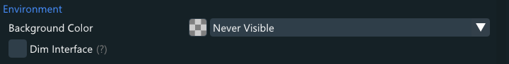

- **Background Color**:  
Allows to partially or fully cover the VR scene in the specified color, either only while looking at the Desktop+ dashboard tab or at all times.  
Click on the color button to switch to the color picker page and click on the drop-down list to choose when the background color appears.

  On the color picker page, click on the "Original" preview box to restore the previous value. Right click the picker to switch between hue bar and hue wheel style pickers.
  
- **Dim Interface**:  
Dims the SteamVR dashboard and Desktop+ UI while the Desktop+ dashboard tab is open.

#### Profiles

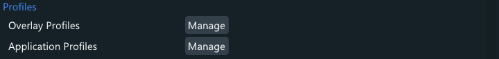

- **Overlay Profiles**:  
Press the button to manage overlay profiles. Overlay profiles allow saving and loading multiple overlay setups.
- **Application Profiles**:  
Press the button to manage application profiles. Application profiles allow to automatically load an overlay profile or execute actions when a SteamVR application is launched.
  
#### Actions

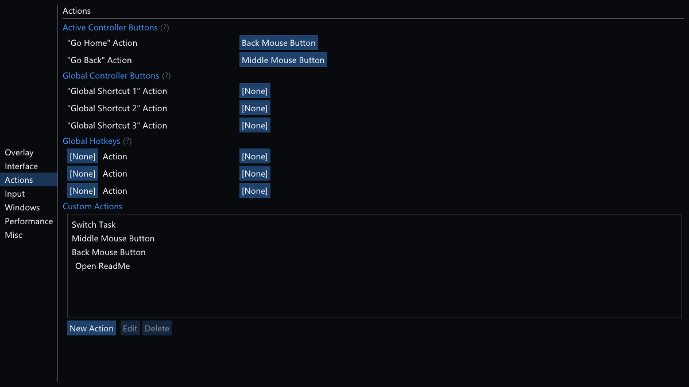

- **Actions**:  
Press [Manage] to go to the [Manage Actions page](#manage-actions-page).

- **Action Buttons (Default)**:  
Press [X Actions Selected] to change the default order of action buttons displayed in the Floating UI.

- **Action Buttons (Overlay Bar)** (Adv.):  
Press [X Actions Selected] to change the order of action buttons displayed in the Overlay Bar.

- **Active Controller Buttons**  
Controller bindings when pointing at a Desktop+ overlay. The actual buttons used for these are defined in the VR Dashboard SteamVR input bindings.
  - **[Show Controller Bindings]** (only visible when SteamVR is running):  
  Open the SteamVR Controller Bindings screen for the VR Dashboard.
  - **(Table)**:  
  Action triggered when pressing the "Go Home" or "Go Back" button. This is typically one of the face buttons on the controller by default. Click one of the Action column cells to change the action.
  
- **Global Controller Buttons**  
Controller bindings when the dashboard is closed and not pointing at any overlay. The buttons used for these are defined in the Desktop+ SteamVR input bindings. These bindings will trigger globally as long as no laser pointer is active.
  - **[Show Controller Bindings]** (only visible when SteamVR is running):  
  Open the SteamVR Controller Bindings screen for Desktop+.
  - **(Table)**:  
  Action triggered when pressing the respective bound global shortcut input. Click one of the Action column cells to change the action.
  - **[Add Shortcut]**:  
  Add another shortcut. Up to 20 shortcuts can be added.
  
- **Hotkeys**:  
System-wide keyboard shortcuts. Hotkeys block other applications from receiving that input and may not work if the same combination has already been registered elsewhere.  
Desktop+ will not register a hotkey if no action is assigned to it. Most hotkeys without modifiers will not work while elevated applications have window focus.
  - **(Hotkey Column)**:  
  Keyboard shortcut that triggers the action. Click on the cell to change the hotkey.
  - **(Action Column)**:  
  Action triggered when pressing the respective hotkey. Click on the cell to change the action.
  - **[Remove]**:  
  Remove the hotkey in the hovered row.
  - **[Add Hotkey]**:  
  Add another hotkey. There's no upper limit on hotkeys.
  
#### Keyboard

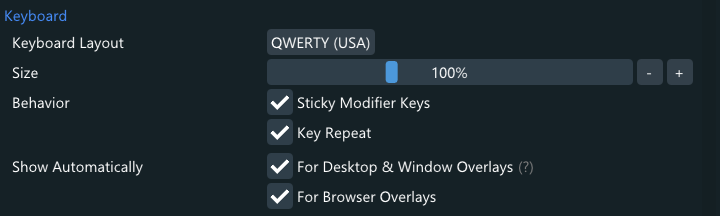

- **Keyboard Layout**:  
Press the button to change the keyboard layout of the Desktop+ keyboard. In desktop mode, the Keyboard Layout Editor can be accessed from there as well.

- **Size**:  
Size of the Desktop+ keyboard. This slider adjusts the size for both inside and outside of the dashboard. Manage [Persistent UI settings](#persistent-ui-page) or resize the keyboard while dragging to adjust them individually.
- **Behavior**:  
  - **[x] Sticky Modifier Keys**:  
  Sets if the modifier keys (ctrl, alt, shift, win) stay pressed until another non-modifier key is pressed.
  - **[x] Key Repeat**:  
  Sets if the key inputs are repeated when held down. Some keys do not repeat even with this enabled in order to mimic real keyboard behavior.

- **Show Automatically**:  
Sets if the Desktop+ keyboard appears automatically when focusing a text input field and disappears again when unfocusing (unless it was manually brought up before).

  This behavior is experimental for desktop and window overlays as there's no reliable way to detect all input fields.  
  It works reasonably well for applications using native controls or sending the correct assistive events.

  The keyboard is always shown automatically for Desktop+ UI elements.
  - **[x] For Desktop & Window Overlays**:  
  Sets if the keyboard is shown automatically for desktop & window overlays.
  - **[x] For Browser Overlays** (only available when Desktop+ Browser is installed):  
  Sets if the keyboard is shown automatically for browser overlays.
  
  
#### Mouse

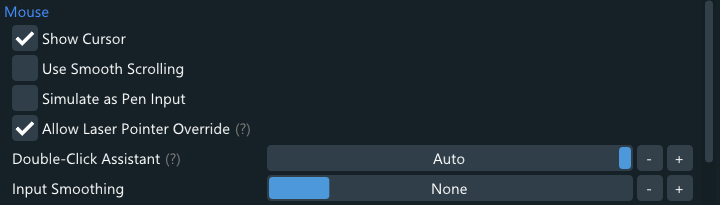

- **[x] Show Cursor**:  
Sets if the cursor is rendered on top of the mirrored overlay. Graphics Capture overlays hide the cursor automatically when the source window is not in focus.

- **[x] Use Smooth Scrolling**:  
Sets if smooth scrolling is used instead of discrete mouse wheel-like scrolling. Smooth scrolling also allows for horizontal and minute scrolling in applications that support it.

- **[x] Simulate as Pen Input**:  
Sets if laser pointer input simulate a touch pen input device instead of a mouse.
This enables gestures meant for pen inputs, such as click drag scrolling in many applications and holding down left-click to perform a right click.

  Some of the pen input behaviors are configurable on the OS-end, and may need to be enabled first.
  
- **[x] Allow Laser Pointer Override**:  
Disables the laser pointer when the physical mouse is moved rapidly. Click the overlay to get the laser pointer back.  
This option is primarily useful when sitting in front of the desk using the real mouse and keyboard while wearing the headset to view the desktop.

- **Double-Click Assistant**:  
Freezes the mouse cursor for the set duration to ease the input of double-clicks. The "Auto" setting uses the double-click duration configured in Windows.  
Moving larger distances from the frozen cursor position cancels the Double-Click Assistant.

- **Input Smoothing**:  
Sets the level of smoothing/stabilization applied to mouse inputs.

#### Laser Pointer

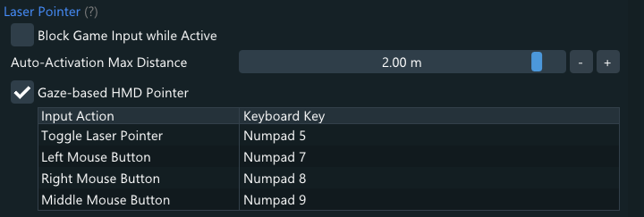

These settings apply to Desktop+'s laser pointer only.

- **[x] Block Game Input while Active**:  
Sets if the laser pointer being active blocks the game from receiving inputs. Even if this is disabled, inputs bound for the laser pointer still take priority over the game's controller bindings and aren't sent to the game.

- **Auto-Activation Max Distance**:  
Maximum allowed distance between overlay and pointing controller to automatically toggle interaction mode while the dashboard is closed. This can be set to "Off" by dragging the slider into the left-most position.

- **[x] Gaze-based HMD-Pointer** (Adv.):  
Enables using HMD gaze to point at Desktop+ overlays. The Auto-Activation Max Distance value is used here as well, if no keyboard key is set for the toggle input action.
  - **(Table)**:  
  Input action triggered when pressing the respective keyboard key. Click one of the Keyboard Key column cells to change the keyboard key. The keyboard keys are optional can stay unset for gaze-only input.

#### Window Overlays

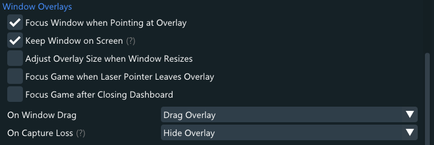

- **[x] Focus Game on Dashboard Deactivation** (Adv.):  
Tries to change the foreground window to the current VR game after the dashboard was closed. Some games may pause or decide to not process inputs when not being in focus on the desktop.  
  Note that some applications such as SteamVR Home do not have a desktop window at all.
  
- **[x] Focus Window when Pointing at Overlay** (Adv.):  
Tries to change the foreground window to the mirrored window when pointing at the overlay. This generally recommended to be left enabled in order to prevent unintended inputs on other windows.  
Note that always-on-top windows will still be in front of the mirrored window and could possibly take the mouse input instead unless the mirrored window is always-on-top as well.

- **[x] Keep Window on Screen** (Adv.):  
Prevents the mirrored window from being outside of the nearest desktop's work area (the space a maximized window takes up). The window is not resized if it does not fit into this space.

- **[x] Adjust Overlay Size when Window Resizes**:  
Automatically adjusts the overlay size when the mirrored window's size changes. This directly affects the overlay's width property.

- **[x] Focus Game when Laser Pointer leaves Overlay**:  
Tries to change the foreground window to the current VR game when the laser pointer leaves a Graphics Capture window overlay.

- **On Window Drag** (Adv.):  
Changes what happens when a window is being dragged. The selected option is only triggered on window drags initiated by Desktop+.

- **On Capture Loss** (Adv.):  
Changes what happens when a window capture is being lost. This usually happens after the target window was closed, but will trigger on any kind of capture loss.  
The "Hide Overlay" option also automatically shows the overlay again when the capture gets restored.

#### Browser

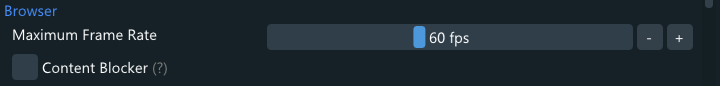

*This is only available if the Desktop+ Browser application component is installed*

- **Maximum Frame Rate**:  
The maximum amount of frames per second browsers overlays will render at. Browser overlays render at variable frame-rates and will not update the overlay if there are no changes.

- **[x] Content Blocker**:  
Sets if the content blocker is enabled. The content blocker built into Desktop+ Browser takes block lists in the AdblockPlus syntax, but doesn't implement cosmetic filters.  
Desktop+ does not come with any block lists by default. They can be added by placing lists files in "DesktopPlusBrowser\content_block". All lists present in the directory will be loaded and used.

#### Performance

These settings allow tweaking the performance characteristics of Desktop+. However, changing any of them should not be required for good results. 

- **Update Limiter**
  - **Limiter Mode** (Adv.):  
  Sets the global limiter mode. May be overridden by overlay-specific update limiter settings.
  - **(Limit Slider)**:  
  Sets the limit in either ms or frames per second.
  
- **Desktop Duplication** (Adv.)
  - **[x] Reduce Laser Pointer Latency**:  
  When this is active, the cursor position is updated instantly while pointing at the overlay. This causes high CPU load, but makes the laser pointer more responsive.
  - **[x] Single Desktop Mirroring**:  
  Mirrors individual desktops instead of cropping from the combined desktop. All Desktop Duplication overlays will be showing the same desktop when this is active.  
  There can be a noticeable performance impact when multiple desktops update constantly. This setting can be used to mitigate it.
  
- **[x] HDR Mirroring**  
  Enables mirroring of desktops and windows using higher bit-depth textures, supporting HDR output.  
  While the full bit-depth is passed to SteamVR, there are no known HMDs capable of making use of HDR output.  
  The primary use-case for this setting is to fix SDR content not being captured correctly while HDR is enabled in the OS.  
  This setting is still considered experimental.
- **[x] Show FPS in Floating UI**  
  When this is active, the number of captured or rendered frames per second, at which the overlay is updated, is displayed in the Floating UI.  
  This number will be the same for all Desktop Duplication overlays, since they share a single backing texture.
- **[x] Adaptive UI Rendering Rate**  
  Disabling this allows turning off UI optimizations that try to lower the rendering rate when not needed.  
  This setting is temporary and will be removed at a later date once these optimizations are considered stable.

#### Version Info

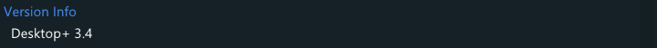

Displays version information of the running build of Desktop+.

#### Warnings

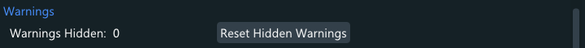

- **Warnings Hidden**:  
Shows how many warnings have been hidden by clicking on "Don't show this again".
- **[Reset Hidden Warnings]**:  
Resets all hidden warnings, causing them to show up again when their condition is fulfilled.

#### Startup

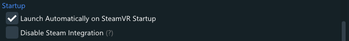

- **[x] Launch Automatically on SteamVR Startup**:  
Sets if Desktop+ is launched automatically alongside SteamVR. This setting controls the SteamVR application configuration value directly and as such is saved and restored by SteamVR itself.

- **[x] Disable Steam Integration** (only available if Desktop+ is being run by Steam):  
Restarts Desktop+ without Steam when it was launched by it. This disables the permanent in-app status, usage time statistics and other Steam features.  
There will still be a brief in-app status and notification from Desktop+ being launched by Steam even if this is active. Steam Cloud functionality may not work as expected.

  An alternative to this option is marking Desktop+ as private on the Steam profile.

#### Troubleshooting

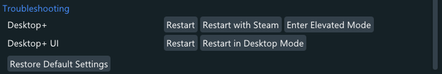

These buttons let you quickly restart components of Desktop+ in case it starts behaving unexpected in some way. 
Settings are saved before restarting and overlays are typically restored without loss afterwards. However, active sessions in browser overlays will be lost.

- **Desktop+**:  
These buttons apply to the main Desktop+ process, responsible for non-UI overlays and most interaction with them.
  - **[Restart]**:  
  Restart Desktop+.
  - **[Enter Elevated Mode]**:  
  Enters elevated mode by launching a secondary Desktop+ process with administrator privileges using the "DesktopPlus Elevated" scheduled task. This button is only visible if [elevated mode](#system-wide-modifications) has been set up.

- **Desktop+ UI**:  
These buttons apply to the Desktop+ UI process, responsible for displaying UI elements and modifying settings.
  - **[Restart]**:  
  Restart Desktop+ UI.
  - **[Restart in Desktop Mode]**:  
  Restart Desktop+ UI in desktop mode. The settings window will display on the desktop and all VR interface elements will be unavailable.
  
- **Restore Default Settings**:  
Press the button to open the [Restore Default Settings page](#restore-default-settings-page), which allows further choices before making any changes.

### Persistent UI Page

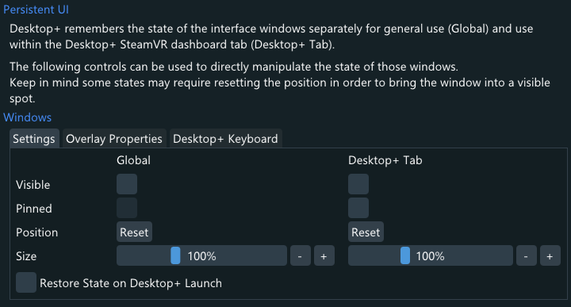

The *Persistent UI* page allows directly manipulating the state of Desktop+ interface windows.  
Settings, Overlay Properties and Desktop+ Keyboard windows can be configured here.

#### Windows

- **[x] Visible**:  
Sets if the window is visible. This is the same as manually showing the window in other parts of the application.

- **[x] Pinned**:  
Sets if the window is pinned. Pinning a window sets the absolute position for the global state to the current Desktop+ tab position. The Desktop+ keyboard can also be pinned in the Desktop+ tab.

- **Position**:  
Press [Reset] to restore the default position for the window. This position is relative to the dashboard for Desktop+ tab state and absolute for the global state.

- **Size**:  
Changes the size of the window. Interface windows can also be resized by using stick or touchpad inputs while dragging them.

- **[x] Restore State on Desktop+ Launch**:  
Sets if the window state will persist between launches of Desktop+. Note that pinned windows may end up getting lost if left in a far away corner of the VR space, especially when facing away from the user.  
However, a position reset can always be done in those cases.

### Manage Overlay Profiles Page

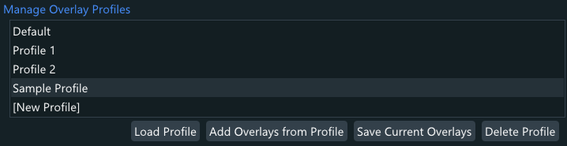

The *Manage Overlay Profiles* page allows loading, saving and deleting overlay profiles.
The buttons below the list apply to the selected item.

If you want to create a new profile, choose "[New Profile]". The default profile can be loaded to quickly reset the overlay configuration.

- **[Load Profile]**:  
Load the selected profile. This will replace all existing overlays.

- **[Add Overlay from Profile]**:  
Adds the overlays from the profile to the overlay list, without overriding any existing ones.

- **[Save Current Overlays]**:  
Saves the selected profile. If you selected "[New Profile]", you it will create a new profile.  
Desktop+ will switch to the Save Current Overlays page before saving, letting you choose which overlays to save and enter a name in case of a new profile.

- **[Delete Profile]**:  
Deletes the selected profile. The button will change label to prompt for confirmation. Press it another time to really delete the profile.

### Manage Application Profiles Page

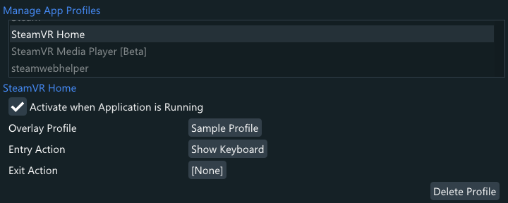

The *Manage Application Profiles* page allows configuration of application profiles.

- **(Application List)**:  
This is a list of all applications registered in SteamVR + applications a profile exists for.  
Most non-Steam VR applications do not register a permanent manifest with SteamVR and as such will only be listed here while they're running, unless an application profile was already created for them.

  While Desktop+ isn't running, only applications a profile exist for are listed.
  
  Inactive profiles are listed with a translucent text color. If an application profile is currently active, it is highlighted in the list with a green text color.
  
#### [Application Name]

The application profile configuration for the application selected in the list above.

- **[x] Activate when Application is Running**:  
Toggles whether the application profile is applied or not.

- **Overlay Profile**:  
Click the button to pick an overlay profile that is loaded when the application is launched.  
The existing overlay configuration is restored when the application is no longer running.

  Changes to the overlay configuration made while an overlay profile is loaded by an application profile are not saved automatically.

- **Entry Action**:  
Click the button to pick an action that is executed when the application is launched. 

- **Exit Action**:  
Click the button to pick an action that is executed after the application has stopped running.

- **Delete Profile**:  
Deletes the selected profile. The button will change label to prompt for confirmation. Press it another time to really delete the profile.  
As the application list contains all registered applications regardless of a profile existing, this will not visibly remove any entry from the list, unless the profile is for an unregistered application.

### Manage Actions Page

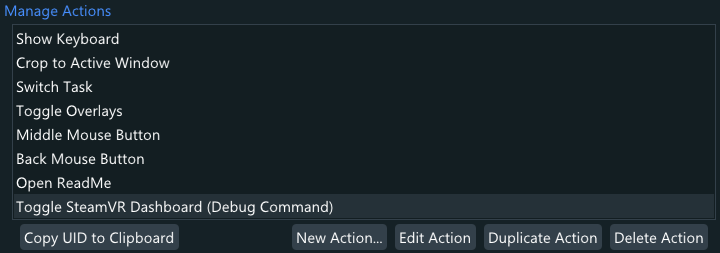

The *Manage Actions* page allows creating, editing and deleting actions.

- **(Action List)**:  
This is a list of all actions configured. The entries can be dragged up and down to change the order of them.  
The buttons below the list apply to the selected item.

- **[Copy UID to Clipboard]** (Adv.):  
Copies the action's unique identifier to the clipboard. This ID can be used in conjunction with the [command-line argument](#command-line-arguments) "--DoAction [UID]" to execute actions from external applications.  
Action UIDs are 64-bit numbers derived from creation timestamp and a random component with a reasonably low chance of collisions. Default actions use special single digit UIDs.

- **[New Action...]**:  
Switches to the [Edit Action page](#edit-action-page) to create a new action.

- **[Edit Action]**:  
Switches to the [Edit Action page](#edit-action-page) to edit the selected action.

- **[Duplicate Action]**:  
Creates a copy of the selected action.

- **[Delete Action]**:  
Deletes the selected action. The button will change label to prompt for confirmation. Press it another time to really delete the action.  
Anything referencing the action like controller buttons, hotkeys or application profiles will show their action be set to "[None]" afterwards.

### Edit Action Page

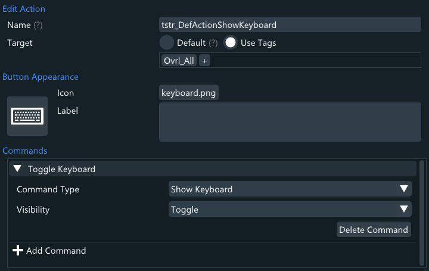

The *Edit Action* page allows creating and editing actions.

- **Name**:  
Sets the name of the action. The default actions use special translation string ID names to automatically match the chosen application language.

- **Target**:  
Sets the target of the action. Default targeting applies the commands to the overlay the action was activated on, or the focused overlay if the former isn't applicable.  
The focused overlay is the overlay that was clicked on with the laser pointer. Clicking on the Floating UI also changes the focused overlay.

  Tag targeting uses a list of overlay tags to target one or multiple overlays. This list is inclusive, meaning adding multiple tags for targeting checks each tag individually for matching targets (i.e. does not require multiple tags on a target).  
  The green tags are implicit auto-tags that match based on overlay properties.
  
#### Button Appearance

- **(Preview Button)**:  
Button showing a preview of the action button with the current settings. It can also be pressed to test the action.

- **Icon**:  
Click the button to pick an icon for the action. Icons are optional and rendered behind the label.  
Custom icons can be added by placing PNG files in the "images/icons" folder. Recommended size is 96x96 pixels.

- **Label**:  
The label of the button with up to 3 lines of text. The lines are always centered and squeezed to fit if they're too long.  
The default actions use special translation string ID labels to automatically match the chosen application language.

#### Commands

List of the commands the action runs when executed. Commands are run sequentially but with no delay between them.  
Consider using the "Launch Application" command to run external scripts if you need more complex capabilities.

Click the command headers to reveal their properties.

- **[Delete Command]**:  
Deletes the command. The button will change label to prompt for confirmation. Press it another time to really delete the command.

- **[Add Command]**:  
Adds another command to the command list.

##### None

No-op command. Occupies an entry but does nothing.

##### Press Key

Presses or toggles a key.

- **Key Code**:  
Click the button to pick the virtual key code pressed by the command. Mouse buttons also have key codes that can be selected.

- **[x] Toggle Key**:  
Toggles the state of the key instead of pressing and holding it until the action is stopped/released.  
Note that key toggling is based on the global key state of the OS and held keys will remain in that state if not released otherwise. However, Desktop+ will release all held-down keys on exit.

##### Set Mouse Position

Moves the mouse cursor to the set position.

- **X/Y**:  
Screen coordinates the mouse cursor is moved to. Coordinates are relative to the top left corner of the primary desktop.

- **[Use Current Mouse Position]**:  
Sets the X and Y values to the current mouse cursor position.

##### Type String

Types the set string.  
This is done via text input simulation and does not send key down and up events for individual keys. As such, not every application will read this kind of input.

- **String**:  
The string typed by the command.

##### Launch Application

Launches external applications.  

- **Executable Path**:  
Path of the application launched. As this goes through the Windows shell, file paths and URLs for registered protocols can also be used.

- **Application Arguments**:  
Arguments passed to the executable. This can usually be left blank.

##### Show Keyboard

Changes visibility of the [Desktop+ VR keyboard](#desktop-keyboard).

- **Visibility**:  
Sets if the commands toggles, always shows, or always hides the keyboard.

##### Crop to Active Window

Crops the targeted overlays to the currently focused desktop window.  
This command acts as a toggle, turning overlay cropping off if the crop is already equal to the active window.

##### Show Overlay

Changes visibility of overlays.

- **Visibility**:  
Sets if the commands toggles, always shows, or always hides the overlays.

- **Target**:  
Sets if the command applies to the action's target overlays or overlays matching a specific set of tags.

- **[x] Undo on Release**:  
Reverts the change made by the command when the action is stopped/released.  
Note that some ways of executing actions start and stop the action immediately.

##### Switch Task

Shows the Windows task switcher or changes the focus to a specific window.  
Showing the task switcher usually works even when an elevated application has focus.

- **Switching Method**:  
Set if the command shows the task switcher or focuses a specific window.

- **Window** (Focus Window method only):  
Press the button to pick a window to focus.
  - **[x] Use Strict Window Matching**:  
  Only allow exact window title matches when searching the window to focus. By default Desktop+ uses a weak window title matching algorithm to account for document-style changing window titles.  
  Use this option if you experience false positives with specific applications.
  
- **[x] Warp Cursor into Window** (Focus Window method only):  
Sets the mouse cursor position to the center of the window that is being focused.

##### Load Overlay Profile

Loads an overlay profile.

- **Profile**:  
Click on the drop-down list to select the profile the command will load.

- **[x] Remove Existing Overlays**:  
Sets if all existing overlays are removed when loading the profile.  
This is equivalent to loading a profile instead of adding overlay from a profile in the [Manage Overlay Profiles page](#manage-overlay-profiles-page).

### Change Action Order Page

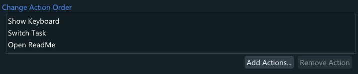

The *Change Action Order* page allows adding, removing and re-ordering actions to action order lists.

- **(Action List)**:  
List of actions in the action order list. The entries can be dragged up and down to change the order of them.

- **[Add Actions...]**:  
Click on the button to pick one or more actions to add to the list.

- **[Remove Action]**:  
Removes the selected action from the action order list.

### Keyboard Layout Page

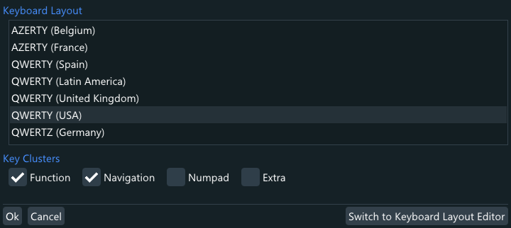

The *Keyboard Layout* page allows changing the layout of the Desktop+ VR keyboard.

- **(Keyboard Layout List)**:  
List of available keyboard layouts for the Desktop+ VR keyboard.

- **[Switch to Keyboard Layout Editor]** (only available in desktop mode):  
Open the keyboard layout editor on the desktop to customize or create custom layouts for the VR keyboard.

#### Key Clusters

- **[x] Function/Navigation/Numpad/Extra**:  
Toggles specific sections of the keyboard layout. Some keyboard layouts may not include all clusters.

### Restore Default Settings Page

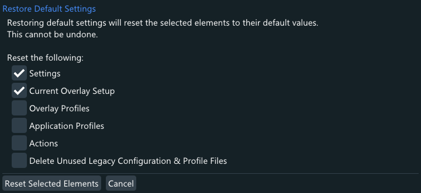

The *Restore Default Settings* page allows choosing specific elements to reset to their default values.
Tick the desired elements to reset and press [Reset Selected Elements]. Desktop+ will restart after making the changes.  
Note that active sessions in browser overlays will be lost when restarting.

It is recommended to use these controls over deleting the configuration files manually. For the Steam version, Steam Cloud would automatically restore the missing files on launch if enabled, undoing the deletion.

## Overlay Properties

### Main Page

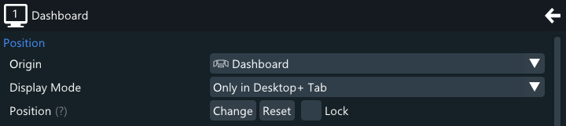

- **(Overlay Icon)**:  
The overlay icon can be double-clicked as an alternative way of toggling overlay visibility.

#### Position

- **Origin**:  
Click on the drop-down list to select the position origin of the overlay. This can be used to attach an overlay to controllers or the HMD.
  - **Play Area**:  
  Attach overlay to the play area. This is absolute positioning relative to the standing play area.  
  Overlays will not move unless the SteamVR room setup changes.
  - **HMD Floor Position**:  
  Attach overlay to the position of the HMD, without rotation.  
  Choosing this origin will reveal the option "[x] Turn with HMD", which will spin the origin along without it tilting in any way.
  - **Seated Position**:  
  Attach overlay to the SteamVR seated position. This origin may have an unexpected position if the active VR game isn't using the seated space.  
  Update the origin position by resetting the seated position in SteamVR. Games may also trigger updates to this position.
  - **Dashboard**:  
  Attach overlay to the SteamVR dashboard. If visibility isn't restricted to dashboard, the origin position updates when the dashboard is brought up.
  - **HMD**:  
  Attach overlay to the HMD. This origin is matches head movement 1:1 and essentially looks static in the headset view.
  - **Left Controller**:  
  Attach overlay to the left motion controller.
  - **Right Controller**:  
  Attach overlay to the right motion controller.
  - **Theater Screen**:  
  Attach overlay to the SteamVR Theater Screen. Choosing to this origin will hide the overlay and reveal the button [Enter Theater Mode] to display the SteamVR Theater Screen. This button does the same as showing the overlay.  
  There can only be one Theater Screen origin overlay active at once.  
  If another overlay of that origin is set to be visible, it'll hide every other one automatically. Theater Screen origin overlays will also be hidden if the SteamVR Theater Screen is taken over by an overlay of another application or when using the "Close Overlay" button below the screen.
  - **Tracker #1** (only visible if a tracker is connected):  
  Attach overlay to the first connected SteamVR tracker device. Using other trackers as the origin is not supported at this time.

- **Display Mode**:  
Click on the drop-down list to select a display mode. Display modes restricts under which condition the overlay is visible. For example, "Only In-Game" only shows the overlay while a game/scene application is active and hides it while the dashboard is visible.

- **Position**:
  - **[Change]**:  
  Opens the Position Change page and activates overlay drag-mode. You can use the buttons to do manual position adjustments or simply drag the overlay in the VR space to reposition them.  
  Using right-click to drag triggers a gesture drag, allowing you to rotate and scale overlays based on the motions of both hand-controllers.
  - **[Reset]**:  
  Reset the position of the overlay. Depending on the origin the new position will be near the zero point of it or next to the dashboard overlay.
  - **[x] Lock**:  
  Lock the position of the overlay. This option only prevents dragging the overlay. Position-locked overlays will still move along with their set origin.  
  The lock state is temporarily toggled off for the respective overlay when using the Position Change page in the Overlay Properties window, but is restored when leaving the page again.

#### Appearance

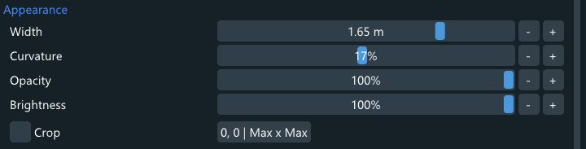

- **Width**:  
Width of the overlay. The height is automatically determined by the aspect ratio of the mirrored content.

- **Curvature**:  
Sets how much the overlay curves inwards.

- **Opacity**:  
Sets how translucent the overlay appears. 100% is fully visible.

- **Brightness**:  
Sets how bright the overlay appears. 100% is full brightness.

- **[x] Crop**:  
Sets if the cropping area is applied.
  - **[X, Y | Width x Height]** (Cropping Area button):  
  Press this button to open the [Cropping Area page](#cropping-area-page) to change how the overlay is cropped.

#### Capture

*This is only shown for desktop and window overlays and if advanced settings are enabled*

- **Capture Method**:  
Changes the capture API used for this overlay. Graphics Capture additionally allows capturing windows directly. See [Desktop Duplication vs. Graphics Capture](#desktop-duplication-vs-graphics-capture) for a detailed comparison of both APIs.

- **Source** (Desktop Duplication):  
Click on the drop-down list to select a desktop to crop the combined desktop mirror to. This selection is also used when resetting the cropping rectangle.

- **Source** (Graphics Capture):  
Click on the button to select the capture source for the overlay. The list on the opening page contains available capturable desktops and windows.
  - **[x] Use Strict Window Matching**:  
  Only allow exact window title matches when restoring the overlay's capture. By default Desktop+ uses a weak window title matching algorithm to account for document-style changing window titles.  
  Use this option if you experience false positives with specific applications.

#### Performance Monitor

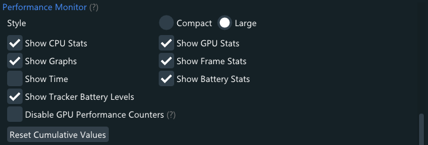

*This is only shown for Performance Monitor overlays*

The Performance Monitor lets you quickly check the current state of your system from within VR in real time.  
While it's possible to create as many overlays of it as desired, they will all be showing the same content. Performance Monitor properties are global.

- **Style**:  
Switches between a large and compact style of the Performance Monitor.  
The compact style does not allow displaying the current time.
- **[x] Show (Item)**:  
Allows to customize which performance characteristics and states are displayed on the Performance Monitor.
- **[x] Disable GPU Performance Counters** (Adv.):  
Disables display of GPU load % and VRAM usage. This prevents GPU hardware monitoring related stutter with certain NVIDIA drivers.
- **[Reset Cumulative Values]**:  
Resets statistics that build up over time, such as average FPS, dropped frames, and reprojection ratio.  
These values are also reset automatically when the game/scene application changes or SteamVR goes into standby mode.
  
Note that Performance Monitor overlays do not update or may be invisible while the Desktop+ UI is open in desktop mode.

#### Browser

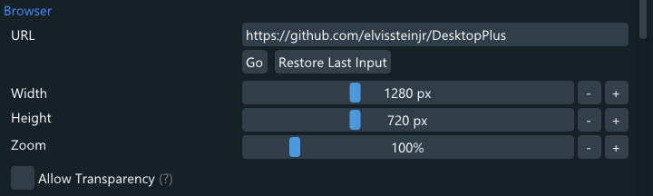

*This is only shown for browser overlays*

- **URL**:  
Address the browser overlay is displaying. This changes as browsing is done in the overlay. Local addresses can be used as well.
  - **[Go]**:  
  Start navigation. Pressing enter on the text input field works as well.
  - **[Restore Last Input]**:  
  Reset the text input field to the last manually entered URL. This is useful to go back to the initial location after navigating away from it.
  
- **Width/Height**:  
Render resolution of the browser overlay. Changing this is akin to resizing a web browser window.
- **Zoom**:  
Zoom level used in the browser overlay.

- **[x] Allow Transparency**:  
Allows web pages to use transparency in the page background. This allows for RGBA web rendering if the page is set up for it.  
However, this results in the default background color being transparent. This means pages which don't define anything themselves and expect it to be opaque white will not look correct.

  Changing this property requires a reset of the browser context. Such a reset will clear the browsing history and reload the page. Click [Recreate Browser Context] to proceed after changing the property.

#### Advanced

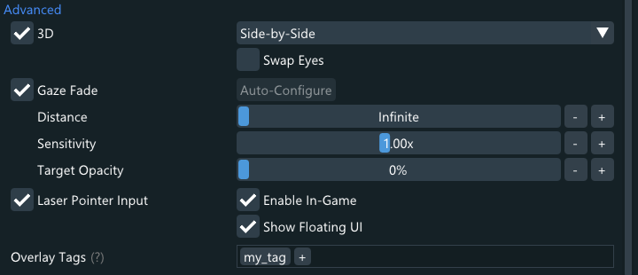

- **[x] 3D**:  
Sets if the 3D properties are applied.
  - **3D Mode**:  
  Use the drop-down list to change the way the overlay's image is split up between both eyes to create a 3D image.
  - **[x] Swap Eyes**:  
  Swaps which eye gets each split up part of the overlay image.

- **[x] Gaze Fade**  
Sets if the Gaze Fade properties are applied.
Gaze Fade gradually fades the overlay to 0% opacity when not looking at it. When the overlay is at 0% opacity, it is considered inactive and will not react to laser pointer input.
  - **[Auto-Configure]**:  
  Configure distance and sensitivity values automatically from the current gaze and overlay settings. After clicking, a pop-up will appear asking to look at the overlay for 3 seconds.
  - **Distance** (Adv.):  
  Distance of the gaze point from the HMD. Put the slider to the leftmost value to set it to "Infinite".
  - **Sensitivity** (Adv.):  
  Rate at which the fading occurs. As Gaze Fade only takes the center point of the overlay in account, adjusting this value depending on the overlay size is recommended.
  - **Target Opacity** (Adv.):  
  Minimum opacity Gaze Fade will set when not looking at the overlay. If this value is higher than the overlay's opacity property, Gaze Fade will be reversed and fade the overlay in when not looking at it.
  
- **[x] Laser Pointer Input**  
Sets if laser pointer input is enabled for this overlay. The laser pointer will pass through the overlay if this is disabled.
  - **[x] Enabled In-Game**:  
  If this is disabled, the laser pointer will pass through the overlay outside of the dashboard.
  - **[x] Show Floating UI**:  
  Sets if the Floating UI is displayed when pointing at this overlay.

- **Overlay Tags**  
The tags assigned to this overlay. Overlay tags are used by actions to target specific overlays. See [Overlay Tags](#overlay-tags) for more details.
  
#### Performance

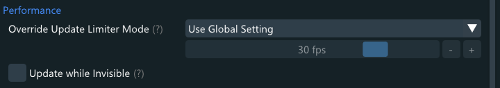

- **Override Update Limiter Mode** (only visible for desktop and window overlays):  
Sets the limiter mode for this overlay only. Overrides the global setting.  
Due to the shared textures between overlays, the limit resulting in the most updates among all active overlays of the same capture source is used.

- **Maximum Frame Rate** (only visible for browser overlays):  
The maximum amount of frames per second this browser overlay will render at. Overrides the global setting.

- **[x] Update when Invisible** (Adv.):  
Updates the overlay even when invisible from Opacity setting or Gaze Fade.  
This helps with third-party applications accessing the overlay's contents but is not recommended otherwise. Updates are still suspended if the overlay is disabled or hidden by Display Mode setting.  
Allowing overlays to update when not needed can have a significant performance impact.
  
#### Interface

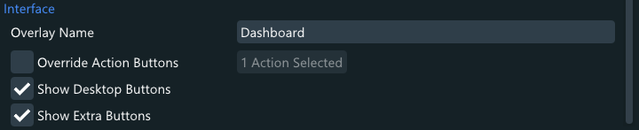

- **Overlay Name**:  
Set a custom name for the overlay. Leave this blank to let Desktop+ choose a name automatically.

- **[x] Override Action Buttons**:  
Set if overlay-specific order and visibility of action buttons is used.
  - **[x Actions Selected]**:  
   Press this button to open the [Change Action Order page](#change-action-order-page). Actions can be re-ordered by dragging the entries up and down.

- **[x] Show Desktop Buttons**:  
Adds buttons for quickly switching desktops to the Action Bar of the Floating UI.

- **[x] Show Extra Buttons**:  
Adds overlay-type-specific buttons to the Main Bar of the Floating UI.  
Examples for such buttons are "Add Active Window as Overlay" (desktop overlays only), "Reset Cumulative Values" (Performance Monitor only), and browser overlay controls.

### Change Overlay Position Page

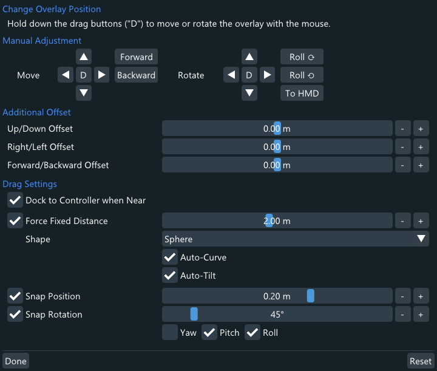

The *Change Overlay Position* page allows making adjustments to the overlay's position and change laser pointer drag behavior.

#### Manual Adjustment

Press the buttons to make manual adjustments to the overlay's position and orientation. The changes are applied relative to the overlay's current position.  

- **[D]** (only available in desktop mode):  
Click and hold the drag buttons to move or rotate the overlay with the mouse. Scroll wheel input applies forward/backward movement and roll adjustments.

#### Additional Offset

These offsets are applied on top of the overlay's position.

- **Up/Down/Left/Right/Forward/Backward Offset** (Adv.):  
Additional offset in the specific direction in meters. The directions are relative to the overlay's orientation.

#### Drag Settings

Change these settings to adjust the laser pointer drag behavior. Drag settings are global and affect every overlay drag, except Desktop+ interface windows.

- **[x] Dock to Controller when Near**:  
Sets if auto-docking is enabled. Auto-docking automatically changes the dragged overlay's origin to the left or right hand controller when the drag is released near them.

- **[x] Force Upright Orientation**:  
Forces the overlay to stand straight up. Only yaw rotations are applied.

- **[x] Force Fixed Distance**:  
Force a fixed distance between the overlays and the user.  
The reference position for this is always based on the headset position, but is only updated when the dashboard is brought up or drag-mode is toggled on while the dashboard is not active. Small changes in position are ignored to allow for a more fixed reference position between adjustments.  
Using stick or touchpad to change the distance of an overlay during a drag will adjust the Fixed Distance value while this drag setting is enabled.
  - **Shape**:  
  Sets the shape the fixed distance is computed as. This can be set to sphere or a cylinder.
    - **[x] Auto-Curve**:  
    Automatically change the dragged overlay's curvature property to match the chosen shape.
    - **[x] Auto-Tilt**:  
    Automatically tilt the dragged overlay alongside the chosen shape.
  
- **[x] Snap Position**:  
Snaps the position to a 3D grid of the given size.  
Note that the overlay origin itself may still be moving and make it difficult to line up multiple overlays together.

### Cropping Area Page

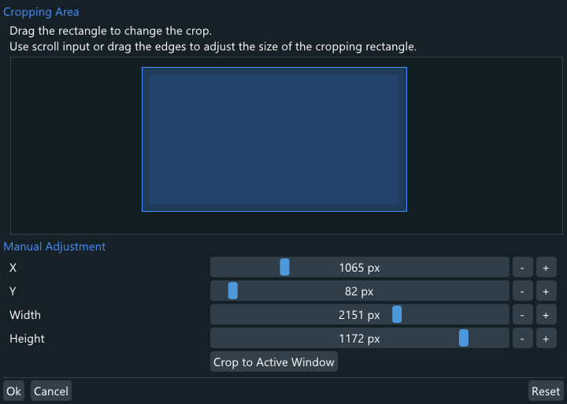

The *Cropping Area* page allows changing the overlay's cropping area.

The cropping area is a rectangle the overlay content is cropped to. If the rectangle is larger than the overlay content, it's clamped to the maximum possible area.  
Cropping areas are preserved when switching between capture sources. This can lead to an invalid rectangle being set for the new capture source, making the overlay essentially invisible as a result.  
In that case, a "(!)" warning is displayed next to this crop setting on the main page and it's recommended to simply use the *[Reset]* button to fix it.

- **(Draggable Cropping Rectangle**):  
Represents the overlay's cropping area in relation to its total content size.  
Drag the rectangle to move it within the content bounds. Use scroll input or the edges to adjust the size of the cropping area.

- **[Reset]**:  
Reset the cropping area to default values. If a desktop to crop to is set, it will restore the values for that. Otherwise, it resets to maximum possible area.

#### Manual Adjustment

- **X/Y/Width/Height**:  
  Position and size of the cropping area. Width and height can be set to "Max" by dragging the slider into the right-most position. The cropping area will always assume the maximum possible size in that case.
  
- **[Crop to Active Window]** (Desktop Duplication):  
  Change the cropping area to match the foreground window.
  
  
## Desktop Mode

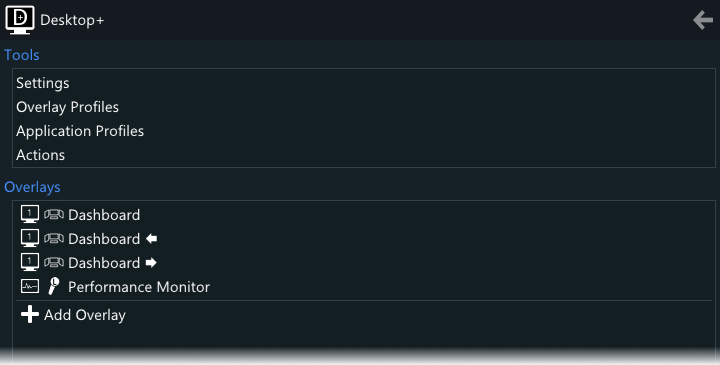

Desktop mode displays the same interface for settings and overlay properties as in VR, but condensed into a single window on the desktop with its own main page to allow quick access and overlay management.

To access desktop mode, either run DesktopPlusUI.exe while SteamVR is not running, press [Restart in Desktop Mode] in the Troubleshooting section of the Settings window, or run DesktopPlusUI.exe with the "--DesktopMode" [command-line argument](#command-line-arguments).  
Note that some settings are not available when running in desktop mode while SteamVR is not running, and the main application process will not be running either. The UI refers to this as "Desktop+ isn't running", even if the UI process might be seen as part of the application.

- **[🡸]**:  
Navigate back to the previous page.  
On pages that can have changes reverted by [Cancel], this button is equivalent to pressing it.

### Tools

Quickly access the settings and several key setting pages.  
The items listed are the same pages as accessible through the main settings page.

### Overlays

List of overlays, similar to the Overlay Bar.  
Overlays can be re-ordered by dragging the entries up and down.

Right-click the entries to access the context menu, which allows to show/hide, clone or remove the overlay.

- **[Add Overlay]**:  
Add a new overlay.  
Performance Monitor overlays cannot be create while in desktop mode as their appearance relies on Desktop+ UI rendering in VR.

### Keyboard Controls

Desktop mode can be fully operated by keyboard alone and also has some mouse shortcuts. These are the controls:

| **Mouse**                   |                                                       |
| :-------------------------- | :---------------------------------------------------- |
| Left Mouse Button           | Interact with Widgets                                 |
| Right Mouse Button          | Context Menu on Overlay List/Edit Slider Value        |
| Mouse Back Button/Backspace | Return to Previous Page                               |
| Mouse Wheel                 | Scroll/Move or Rotate during Overlay Drag             |

| **Keyboard**                | *(activate keyboard controls for these to work)*      |
| :-------------------------- | :---------------------------------------------------- |
| Arrow Keys                  | Navigate/Activate Keyboard Controls                   |
| Spacebar                    | Interact with Widgets                                 |
| Esc                         | Cancel Widget Selection                               |
| Enter                       | Confirm Text Input                                    |
| Menu Key                    | Context Menu on Overlay List                          |
| Ctrl                        | Hold on List Entries while Navigating to Change Order |

## Desktop+ Keyboard

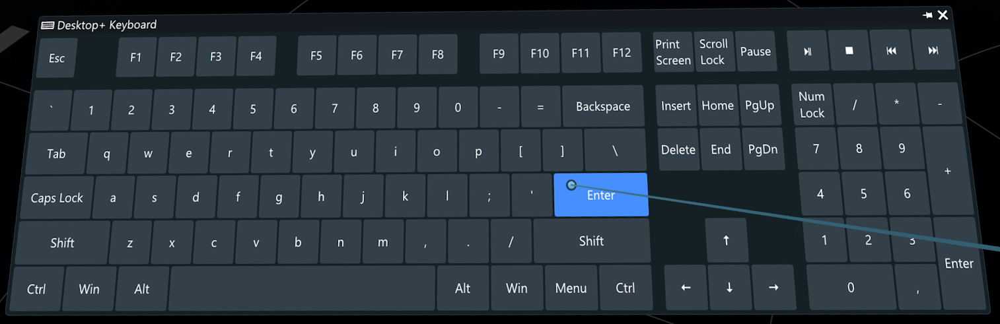

Desktop+ features its own implementation of a customizable VR keyboard. Its behavior, layout, and visible clusters can be changed in the [Keyboard Layout Settings Page](#keyboard).  
The keyboard window can be operated with multiple laser pointers simultaneously. Due to API limitations, there are no haptics on the non-primary laser pointers while the dashboard is visible, however.

Its input behavior is mostly straight forward and mimics a normal PC keyboard. Keys held on the VR keyboard are simulated to be held down until they are released on it, with key repeat for most keys if configured.  
Modifier keys can be sticky, meaning they will remain simulated as held down until they're pressed again. Every key on the VR keyboard can be made sticky by right-clicking them.  
Keys remain pressed when hiding the keyboard, but all still held down keys are released on Desktop+ shutdown.

While shown, the keyboard follows the overlay it was shown for, if any. Or the SteamVR dashboard, while it is visible. Changes to the keyboard position are relative to this, unless the keyboard window is pinned.  
Note that input done on the keyboard always gets sent to the focused overlay (the overlay that was last clicked on with the laser pointer). For desktop/window overlays this does not make any difference, however.

### Keyboard Layout Editor

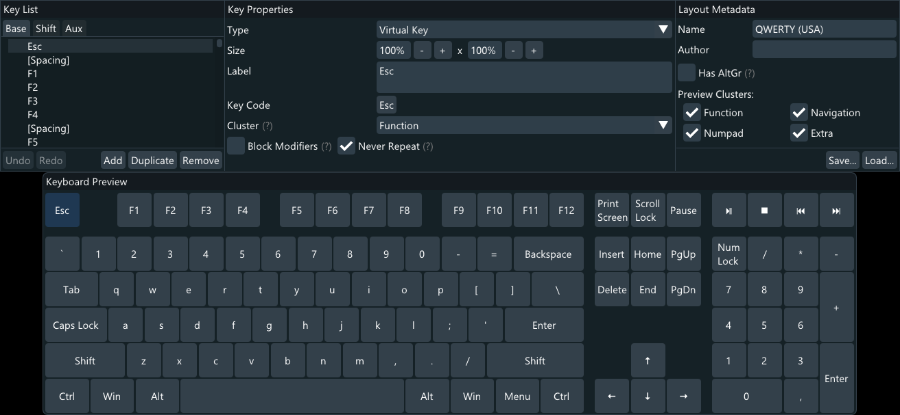

The Keyboard Layout Editor allows to customize or create custom keyboard layouts for the Desktop+ VR Keyboard. It is only available in desktop mode.

#### Key List

List of all keys in the layout. Use the tabs to switch between sub-layouts.

##### Sub-Layouts

- **Base**:  
Normal layout displayed by default.

- **Shift**:  
Shifted layout displayed when any of the shift keys are held, or caps lock is active.  
Usually features capital letters and special characters.

- **AltGr** (only available if "[x] Has AltGR" is ticked):  
AltGr layout displayed when AltGr is being held. Not present on US-style layouts.  
Usually features third-level letters and special characters.

- **Aux**:  
Auxiliary layout. Only displayed if explicitly switched to via a "Toggle Sub-Layout" key.  
This can be anything or just remain unused.

##### Sub-Layout Key List

List of all keys in the sub-layout.  
Click an entry to select the key or row and displays its properties in the Key Properties window.  
Entries can be dragged up or down to re-arrange their order.

##### Bottom Row

- **[Undo]**:  
Undo the last change. The changes history includes modifications made in any part of the Keyboard Layout Editor.  
Ctrl+Z can also be pressed to trigger this button.

- **[Redo]**:  
Redo the reverted last change.  
Ctrl+Y can also be pressed to trigger this button.

- **[Add]**:  
Add a new key. The key is created next to the current selection.  
To add a new row, select an existing row before adding a key.  
Adding too many keys in a row will cause them to be cut off. While there is no limit of rows enforced, a scroll bar will appear in the editor preview and VR if the window space is exhausted.

- **[Duplicate]**:  
Creates a copy of the currently selected key or row. This copy is created next to the original.

- **[Remove]**:  
Removes the selected key or row. There is no confirmation step for this action, but it can always be undone.

#### Key Properties

- **Type**:  
Sets the type of the key. Some key types have their own specific properties, listed below.

- **Size**:  
Sets the width and height of the key. 100% is the size of a standard key and compatible with common key size definitions.

- **Label** (not available for "Blank Space"-type keys):  
The label displayed on the key. The text is horizontally and vertically centered on the key as a whole (as opposed to per-line centering of action button labels). 100% height keys typically fit two lines of text.

- **Cluster**:  
Assign clusters to keys to allow selectively disabling them in the settings later. As "Blank Space"-type keys are also part of clusters, the assignments has to be chosen carefully to not break the layout when toggling them.

##### Virtual Key / Virtual Key (Toggle) / Virtual Key (ISO-Enter)

Simulates a key press or toggle of a virtual key code.  
The ISO-enter variant allows combining two keys in adjacent rows to build an ISO-enter shaped key.

- **Key Code**:  
Click the button to pick the virtual key code pressed by the key. Mouse buttons also have key codes that can be selected.

- **[x] Block Modifiers** (not available for "Virtual Key (Toggle)"):  
Releases all modifiers when this key is pressed. This is useful when the key's sub-layout differs from the required modifier state of the simulated input.

- **[x] Never Repeat**:  
Disable key repeat for this key, regardless of the global key repeat setting. This is useful for keys that don't repeat when held on a real keyboard.

##### String

If the string is a single character, Desktop+ will try to figure out which keys to press on the real keyboard layout to simulate the input.  
If the string is multiple characters, input is done via text input simulation and not sending key down/up events for individual keys. Not every application will read this kind of input.

It is recommended to use this key type for non-basic character keys to increase application compatibility.

- **String**:  
The string input simulated when pressing the key.

##### Toggle Sub-Layout

Explicitly switch to a different sub-layout. This is always a toggle. Place an identical key in the target sub-layout to allow switching back.  
Shift and AltGr sub-layouts are switched to automatically depending on the related modifier's state, making this only necessary to reach the Aux sub-layout.

- **Sub-Layout**:  
Sets the sub-layout to toggle.

##### Action

Execute an action when pressing the key. This works the same as action buttons in the [Floating UI Action Bar](#action-bar).

- **Action**:  
Click the button to pick the action that is executed when the key is pressed. 

#### Layout Metadata

- **Name**:  
Name of the keyboard layout. This is what it is listed as in the [Keyboard Layout Settings Page](#keyboard).

- **Author**:  
Name of the keyboard layout's author. This is displayed in the [Keyboard Layout Settings Page](#keyboard).  
Official layouts leave this field blank.

- **[x] Has AltGr**:  
Sets if the AltGr sub-layout should be present. This is typically left unticked for US-style layouts.

- **Preview Clusters**:  
Untick clusters to check how the layout will look with different [key clusters settings](#key-clusters) set.  
The state of this does not affect the saved layout.

- **[Save...]**:  
Click this button to save the layout. A pop-up will open allowing you to choose the file name or to overwrite an existing layout.  
Keyboard layouts are stored in the "keyboards" directory found in the application's install directory.

- **[Load...]**:  
Click this button to load a different layout. A pop-up will open allowing you to choose the next layout.  
Note that there is no additional confirmation step and unsaved changes will be lost when loading a different layout.

#### Keyboard Preview

A preview of how the keyboard will look in VR.  
Left-click individual keys to select them in the key list or right-click a key to select the row it belongs to.

# Performance Considerations

Desktop+ was written to be lean in both computational load and memory footprint. However, functionality does not come without a price, so knowing the performance characteristics of the application can be helpful.

In general, configured, but inactive overlays are without noticeable performance penalty. Mirroring of the desktops or windows is paused completely while no overlays using the source are active.  
An overlay is considered inactive when it's not enabled or visible. This means display modes hiding an overlay and Gaze Fade setting its opacity to 0% are ways to set an overlay inactive.
Overlays merely outside the view are *not* considered inactive, but may still have a lower GPU load from being culled from rendering by the VR Compositor.

If possible, avoid using Over-Under 3D, as it involves an extra conversion step and textures for each individual overlay. Textures are not shared for such overlays. Prefer Side-by-Side 3D instead.  
On certain multi-GPU setups, such as laptops with a hybrid GPU solution, textures have to be copied between GPUs since the desktops are typically rendered on the integrated GPU while the HMD is connected to the dedicated GPU. This comes with a significant performance penalty. If possible, consider deactivating the integrated GPU altogether.

## Desktop Duplication

All Desktop Duplication overlays share a single texture, meaning additional overlays are fairly cheap. Mirroring is stopped when no Desktop Duplication overlays are active.  
Cursor movement is decoupled from the screen's refresh-rate and can cause GPU load spikes, especially when a mouse with a high polling rate is used. If this is undesirable, use the Update Limiter with a low frame time limit to mitigate this.

## Graphics Capture

All Graphics Capture overlays using the same source are sharing a single texture, meaning additional overlays of the same source are fairly cheap.  
Graphics Capture is generally a more efficient capture method than Desktop Duplication. However, keep in mind that many individual window overlays can easily end up performing worse than carefully cropped desktop overlays.

## Desktop Duplication vs. Graphics Capture

Desktop+ features two capture methods for overlays. Both have different strengths and weaknesses. Using Graphics Capture for desktop mirroring is usually only recommended on the latest Windows version.

### Desktop Duplication

- Supported on systems with Windows 8.1 and newer
- Mirrors desktops
- Decoupled cursor movement
- Only updates on screen changes
- Supports mirroring applications in exclusive fullscreen mode
- Supports mirroring exclusive fullscreen applications at unconstrained frame-rates

#### Mirroring at Unconstrained Frame-Rates

Desktop Duplication supports mirroring exclusive fullscreen applications at unconstrained frame-rates. Actual support depends on how the application does its rendering, but it works for most.  
For this to work, the following conditions have to be met:

- Application has to run in exclusive fullscreen mode
- VSync has to be disabled
- Fullscreen optimizations have to be disabled*

* May not be required for certain games using OpenGL or Vulkan to render.

Fullscreen optimizations can be disabled on a per-application basis in the Compatibility tab of the executable's properties window on Windows 10 version 1803 or newer.

### Graphics Capture

- Supported on systems with Windows 10 version 1903 and newer*
- Mirrors desktops or windows
- Cursor movement at source monitor refresh rate
- Always updates at monitor refresh rate (does not apply to Windows 11 24H2 and newer)
- Supports direct mirroring of occluded windows
- Additional Desktop+ features for window overlays
- Draws yellow rectangle over mirrored sources (not visible in the capture, does not apply to Windows 11 and newer)
- More efficient than Desktop Duplication (but the fixed refresh rate may nullify this with high refresh rate displays)

* Windows 10 version 1903 is required for limited support, version 2004 for full support.

#### Graphics Capture Feature Support

Windows 10 version 1903 is the minimum supported version for Graphics Capture/window overlays.  
Version 2004 additionally enables selecting the combined desktop, as well as supporting disabling the cursor.  
With Windows 11 the yellow border around captures, which is only visible on real display, is removed.  
24H2 additionally enables capturing secondary windows (e.g. pop-up menus), native update limiting, and only updates on content changes.

# VR Interactions

The following interactions done with VR motion controllers trigger specific behavior in Desktop+:

- Holding down left-click on a window's title bar in a desktop overlay and scrolling down: Create window overlay of this window and start dragging it.
- Dragging a window in a window overlay: Trigger configured [window overlay drag behavior](#window-overlays)
- Dragging an overlay near a motion controller: Trigger [overlay auto-docking](#drag-settings) if enabled

# Usage Examples

Provided are a few typical usage scenarios and how to configure Desktop+ for them.  
If unsure, load the "Default" overlay profile as a clean starting point before trying them out.

## Attach Overlay to a Motion-Controller, Wristwatch-Style

1. Click *[+]* in the [Overlay Bar](#overlay-bar) to bring up the overlay capture source pop-up menu.
1. Use the opposite controller to press and hold left click/trigger on the desired capture source from the list.
1. While still holding down, move and rotate the controller to move the newly added overlay towards the target controller until a pop-up saying "Release to dock" appears. ([Overlay auto-docking](#drag-settings) may be disabled if this doesn't work)
1. Release left click/trigger to dock the controller.
1. Optionally enable and adjust *Gaze Fade* in the *Overlay Properties* settings page's [Advanced](#advanced) section. See [Performance Considerations](#performance-considerations) for details on why this is recommended.

The size of the new overlay can be adjusted while dragging by moving the stick or sliding the touchpad left and right.

## Show Multiple Desktops or Windows in the Dashboard at Once

1. Click *[+]* in the [Overlay Bar](#overlay-bar) to bring up the overlay capture source pop-up menu.
1. Use the opposite controller to press and hold left click/trigger on the desired capture source from the list.
1. While still holding down, move and rotate the controller to move the newly added overlay to the desired spot.
1. Release left click/trigger.
1. Click on the icon of the newly added overlay in the [Overlay Bar](#overlay-bar) to bring up its pop-up menu.
1. Click on "Properties..." to bring up the [Overlay Properties window](#overlay-properties) for the overlay.
1. At the top of the window, click on the drop-down list next to *Origin* and choose "Dashboard".
1. Optionally click on the drop-down list next to *Display Mode* and choose "Only in Desktop+ Tab" to limit visibility similar to the default Desktop+ dashboard overlay.
1. Repeat these steps for any other overlays you wish to add. You may also choose to duplicate existing overlays from the overlay icon pop-up menu as a starting point instead.

## Simulate Keyboard Shortcut from Motion-Controller Input

1. Click on *[New Action...]* below the *action list* on the [Manage Actions Page](#manage-actions-page).
1. Optionally give the action a fitting name and label.
1. Click on *Add Command*.
1. Click on the drop-down list next to *Command Type* and choose the "Press Key".
1. Click on *[None]* next to *Key Code* and choose the desired keyboard key or mouse button to be simulated.
1. Repeat step 3 to 5 to add more keys. All of them will be simulated as pressed simultaneously.
1. Click on *[Ok]* at the bottom of the to save the new Action.
1. Return to the settings window's main page.
1. Click on *[None]* next to *Global Shortcut #1* in the *Global Controller Buttons* list found in the *Actions* section.
1. Select the newly created action from the bottom of the list.
1. Open the SteamVR controller bindings for Desktop+ by pressing *[Show Controller Bindings]*
1. Configure the input bindings as desired. Desktop+ shortcut bindings are all boolean actions, meaning you'll find them when configuring digital input types such as *"Button"* or *"Toggle Button"*.
1. To bind the action created in this example, select a controller input, use it as *"Button"* and select *"Do Global Shortcut #1"*.
1. Click the check mark to save the changes.
1. The keyboard shortcut should now be pressed whenever the configured input binding is triggered. The dashboard has to be closed, however.

If you wish to configure a keyboard shortcut to simulated when pressing a button while pointing at a Desktop+ overlay, simply select the action for one of the *Active Controller Buttons*.

If you need further help on how to use the SteamVR binding interface, [OpenVR Advanced Settings' SteamVR Input Guide](https://github.com/OpenVR-Advanced-Settings/OpenVR-AdvancedSettings/blob/master/docs/SteamVRInputGuide.md) is a good place to start.

The SteamVR controller bindings can also be accessed by either going into the SteamVR settings' *Controller* page and clicking *Show old Binding UI*, or loading http://localhost:27062/dashboard/controllerbinding.html with a web browser while SteamVR is running.  
SteamVR will *not* list Desktop+ in the pop-up that appears by pressing the *Manage Controller Bindings* button, so make sure to not accidentally click that button instead.  
SteamVR may not list Desktop+ right after its first launch. Try restarting SteamVR in that case.

# Advanced Features

## Hidden Configuration Settings

There are a handful of advanced configuration settings which aren't exposed in the settings interface.  
These config keys can be found in *config_default.ini* alongside comments about their functionality.

## System-wide Modifications

The "misc" directory found in the application's install directory contains a collection of scripts that make system-wide changes to enable additional access privileges for Desktop+.

Please make sure to read "!About this folder.txt" in the same directory before running any of them to understand the consequences of doing so.

## Command-Line Arguments

The following arguments can be passed to Desktop+ to change its behavior. Most of these are accessible in other ways via the UI and don't need to be used manually.

| Executable        | Argument         | Description |
| :---------------- | :--------------- | :---------- |
| DesktopPlus.exe   | --ElevatedMode   | Launch in elevated mode. This is what the elevated task uses. Elevated mode runs as a secondary process taking input from an existing DesktopPlus.exe process and will not work if one isn't already running. |
| DesktopPlus.exe   | --DoAction [UID] | Execute the action with the specified UID. An action UID can be obtained by pressing [Copy UID to Clipboard] in the [Manage Actions page](#manage-actions-page). This runs as a secondary process that passes the command on and then exits and will not work if the DesktopPlus.exe process isn't already running. |
| DesktopPlusUI.exe | --DesktopMode    | Force launching in desktop mode. |
| DesktopPlusUI.exe | --KeyboardEditor | Launch as Keyboard Editor. This argument also forces desktop mode. |
| Both              | -v [verbosity]   | Set the verbosity level used for logging. Available levels are 0 (default), 1 (enables additional verbose logging), INFO, WARNING, ERROR and OFF. |

### Desktop+ Browser

Command-line arguments for Chromium Embedded Framework can be set in config.ini via the *CommandLineArguments* key in the *[Browser]* section.
